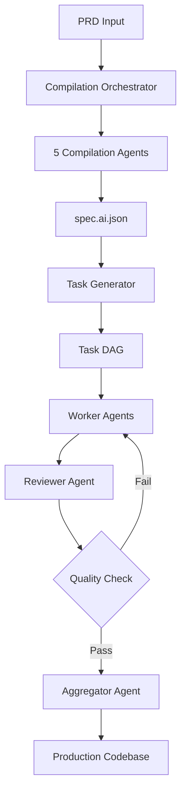

# IdeaForge

**AI-Powered CLI Tool for Converting PRDs into Executable Code**

IdeaForge transforms human-readable Product Requirements Documents (PRDs) into structured, AI-ready specifications, executes implementation tasks with AI agents, and assembles complete, production-ready codebases.

## 🚀 What IdeaForge Does

- **Parses PRDs** (.md, .pdf, .docx) using natural language processing with OCR support
- **Extracts structured data** via 7 specialized AI agents:
  - 📋 **Summary Agent** - Project overview, stakeholders, and business context
  - 🏗️ **Entity/API Agent** - Data models, database schemas, and API endpoints
  - ⚖️ **Constraints Agent** - Performance, security, compliance, and business rules
  - 🎯 **Scenarios Agent** - Given/When/Then acceptance criteria and test cases
  - 💡 **Hints Agent** - Implementation guidance and tech stack recommendations
  - 👷 **Worker Agent** - Executes tasks with full tool access (file system, testing, linting)
  - 🔍 **Reviewer Agent** - Comprehensive code review with quality assurance
  - 🔗 **Aggregator Agent** - Merges outputs into production-ready codebase
- **Generates complete specifications** - `spec.ai.json`, `spec.ai.md`, and individual task files
- **Executes implementation tasks** - Parallel task execution with optional voting strategies
- **Enforces quality loops** - Automated review cycles until acceptance criteria are met
- **Assembles production code** - Complete codebase with tests, documentation, and deployment configs
- **Persistent project state** - SQLite database with full traceability and versioning

## 📦 Installation

### Prerequisites

- **Node.js 20+** - Required for modern ES modules and AI SDK
- **OpenAI API Key** - Set as `OPENAI_API_KEY` environment variable

### Install & Setup

```bash
# Clone and install dependencies
npm install

# Set your OpenAI API key
export OPENAI_API_KEY=your-api-key-here

# Build CLI executable (optional)
npm run build

# Run your first compilation
npm run dev compile test-prd.md --verbose
```

### Global Installation (Coming Soon)

```bash
npm install -g ideaforge
ideaforge compile your-prd.md
```

## 🛠️ Usage

### Complete Pipeline (Recommended)

```bash
# Run full pipeline: compile → run → review → aggregate
npm run dev all your-prd.md

# With advanced options
npm run dev all your-prd.md --project my-app --parallel 4 --voting committee:3 --max-iter 5 --verbose
```

### Individual Commands

#### 1. Compile PRD → Specification

```bash
# Basic compilation
npm run dev compile your-prd.md

# Advanced compilation options
npm run dev compile your-prd.md \
  --project my-app \
  --workspace ./custom-workspace \
  --model gpt-4o \
  --output ./my-spec.json \
  --dry-run \
  --verbose
```

#### 2. Execute Implementation Tasks

```bash
# Basic task execution
npm run dev run --project my-app

# Parallel execution with voting
npm run dev run --project my-app \
  --parallel 4 \
  --voting self-consistency:3 \
  --model gpt-4o \
  --verbose
```

#### 3. Review & Quality Assurance

```bash
# Review all tasks
npm run dev review --project my-app

# Review specific task with custom iterations
npm run dev review --project my-app \
  --task T-001 \
  --max-iter 5 \
  --verbose
```

#### 4. Aggregate & Build

```bash
# Merge outputs into production codebase
npm run dev aggregate --project my-app --verbose
```

#### 5. Bundle for Deployment

```bash
# Create deployment package
npm run dev bundle --project my-app --out ./my-app-bundle.zip
```

### Available Commands Summary

| Command                      | Purpose                                                | Key Options                                        |
| ---------------------------- | ------------------------------------------------------ | -------------------------------------------------- |
| `compile <prd-file>`         | Convert PRD to structured specification                | `--project`, `--workspace`, `--model`, `--dry-run` |
| `run --project <name>`       | Execute implementation tasks in parallel               | `--parallel`, `--voting`, `--model`                |
| `review --project <name>`    | Run quality assurance and review loops                 | `--task`, `--max-iter`                             |
| `aggregate --project <name>` | Merge outputs into production codebase                 | `--verbose`                                        |
| `all <prd-file>`             | Complete pipeline (compile → run → review → aggregate) | All above options                                  |
| `bundle --project <name>`    | Create deployment package                              | `--out`                                            |

### Voting Strategies

IdeaForge supports advanced voting strategies for improved code quality:

- **`self-consistency:N`** - Generate N variants, auto-select best (e.g., `self-consistency:3`)
- **`pair-debate:N`** - Two agents debate solutions, arbiter decides (e.g., `pair-debate:2`)
- **`committee:N`** - N agents propose solutions, ranked by quality (e.g., `committee:5`)

```bash
# Example with voting
npm run dev run --project my-app --voting committee:3 --parallel 2
```

## 📁 Output Structure

IdeaForge creates a comprehensive workspace for each project with organized outputs:

```
projects/your-project/
├── inputs/
│   └── raw.md                    # Original PRD file
├── spec/
│   ├── spec.ai.json              # 🎯 Canonical machine-readable specification
│   ├── spec.ai.md                # Human-readable specification
│   └── compilation-metadata.json # Compilation timing and agent details
├── tasks/
│   ├── T-001.task.md             # Individual task specifications
│   ├── T-002.task.md             # Generated from spec.ai.json
│   └── ...
├── build/                        # 🚀 Production-ready codebase
│   ├── src/                      # Application source code
│   │   ├── models/               # Entity/database models
│   │   ├── api/                  # API endpoints and routes
│   │   ├── services/             # Business logic
│   │   └── utils/                # Utility functions
│   ├── tests/                    # Comprehensive test suites
│   │   ├── unit/                 # Unit tests
│   │   ├── integration/          # Integration tests
│   │   └── e2e/                  # End-to-end tests
│   ├── docs/                     # Generated documentation
│   ├── package.json              # Dependencies and scripts
│   ├── openapi.yaml              # Generated API specification
│   ├── README.generated.md       # Project documentation
│   ├── Dockerfile                # Container configuration
│   └── .env.example              # Environment variables template
├── reports/                      # Quality assurance and tracing
│   ├── trace.jsonl               # Execution traces and metrics
│   ├── reviews/                  # Code review results
│   │   ├── T-001-review.json     # Individual task reviews
│   │   └── ...
│   ├── coverage/                 # Test coverage reports
│   └── e2e/                      # End-to-end test results
├── questions.md                  # Ambiguities requiring clarification
└── ideaforge.config.json         # Project-specific configuration
```

### Key Output Files

| File                  | Purpose                         | Generated By       |
| --------------------- | ------------------------------- | ------------------ |
| `spec.ai.json`        | Canonical project specification | Compilation agents |
| `spec.ai.md`          | Human-readable specification    | Spec assembler     |
| `T-*.task.md`         | Individual task specifications  | Task generator     |
| `build/src/`          | Production application code     | Worker agents      |
| `build/tests/`        | Comprehensive test suites       | Worker agents      |
| `openapi.yaml`        | API documentation               | Aggregator agent   |
| `README.generated.md` | Project documentation           | Aggregator agent   |
| `trace.jsonl`         | Execution traces and metrics    | All agents         |
| `reviews/*.json`      | Quality assurance reports       | Reviewer agent     |

## ⚡ Advanced Features

### 🗳️ Voting Strategies

IdeaForge implements sophisticated voting mechanisms to improve code quality through multi-agent consensus:

#### Self-Consistency Voting

```bash
npm run dev run --project my-app --voting self-consistency:3
```

- Generates N independent implementations of each task
- Uses automated scoring to select the best solution
- Ideal for critical tasks requiring high reliability

#### Pair Debate

```bash
npm run dev run --project my-app --voting pair-debate:2
```

- Two agents propose competing solutions
- Arbiter agent evaluates and selects winner
- Excellent for exploring alternative approaches

#### Committee Voting

```bash
npm run dev run --project my-app --voting committee:5
```

- Multiple agents propose solutions
- Ranked by comprehensive quality metrics
- Best for complex tasks with multiple valid approaches

### 🔄 Review Loops & Quality Assurance

IdeaForge enforces rigorous quality standards through automated review cycles:

#### Comprehensive Code Review

- **Functionality Validation** - Ensures acceptance criteria are met
- **Code Quality Checks** - Linting, formatting, and best practices
- **Security Analysis** - Vulnerability scanning and compliance
- **Performance Validation** - Meets performance constraints
- **Test Coverage** - Comprehensive test suites with high coverage
- **Documentation Review** - Clear, complete documentation

#### Iterative Improvement Process

```bash
npm run dev review --project my-app --max-iter 5
```

1. **Worker Agent** implements task
2. **Reviewer Agent** performs comprehensive analysis
3. **Automated Tools** run tests, linting, security scans
4. **Feedback Loop** provides specific improvement suggestions
5. **Re-implementation** until approval or max iterations reached

#### Quality Metrics & Scoring

- **Overall Quality Score** (0-100) based on multiple factors
- **Task Completion Rate** - Percentage of acceptance criteria met
- **Code Quality Score** - Clean code principles and best practices
- **Test Coverage** - Unit, integration, and E2E test coverage
- **Security Score** - Vulnerability assessment results

### 🔍 Traceability & Monitoring

Full execution traceability for debugging and optimization:

#### Execution Traces

- **Agent Actions** - Every tool call and decision logged
- **Performance Metrics** - Token usage, latency, and costs
- **Error Tracking** - Detailed error logs with context
- **Quality Progression** - Score improvements across iterations

#### Database Persistence

- **Project State** - Complete project lifecycle tracking
- **Task Dependencies** - DAG execution and dependency resolution
- **Review History** - All review iterations and feedback
- **Artifact Versioning** - File changes and evolution tracking

### 🛠️ Tool Integration

Worker agents have access to comprehensive development tools:

#### File System Operations

- **Read/Write Files** - Full workspace access with safety constraints
- **Directory Management** - Create and organize project structure
- **File Validation** - Syntax and format checking

#### Testing & Quality

- **Test Execution** - Run unit, integration, and E2E tests
- **Coverage Analysis** - Detailed test coverage reporting
- **Linting & Formatting** - Code quality enforcement
- **Security Scanning** - Vulnerability detection

#### API & Documentation

- **OpenAPI Generation** - Automatic API documentation
- **Schema Validation** - Ensure API consistency
- **Documentation Generation** - README and code documentation

### 🎯 Parallel Execution

Efficient task execution with intelligent scheduling:

#### DAG-Based Scheduling

- **Dependency Resolution** - Automatic task ordering
- **Parallel Execution** - Concurrent task processing
- **Resource Management** - Optimal agent utilization
- **Failure Recovery** - Graceful error handling and retry logic

#### Performance Optimization

```bash
npm run dev run --project my-app --parallel 8 --voting committee:3
```

- **Configurable Parallelism** - Adjust based on system resources
- **Load Balancing** - Distribute work across available agents
- **Caching** - Reuse results where possible
- **Incremental Updates** - Only rebuild changed components

## 🔧 Development

```bash
# Run in development mode
npm run dev

# Build CLI executable
npm run build

# Run tests
npm test

# Lint code
npm run lint
```

## 📋 Example Output

From a simple todo app PRD, IdeaForge generates:

```json
{
  "project": "Simple Todo App",
  "entities": [
    {
      "name": "Task",
      "attributes": ["id", "title", "completed", "createdAt"],
      "relations": []
    }
  ],
  "apis": [
    {
      "method": "GET",
      "route": "/tasks",
      "summary": "List all tasks"
    },
    {
      "method": "POST",
      "route": "/tasks",
      "summary": "Create a new task"
    }
  ],
  "scenarios": [
    {
      "id": "AC-001",
      "given": "User wants to add a task",
      "when": "User submits task form",
      "then": "Task is created and displayed"
    }
  ],
  "tasks": [
    {
      "id": "T-001",
      "title": "Implement Task CRUD API",
      "estimatedComplexity": "medium"
    }
  ]
}
```

## 🏗️ Architecture

IdeaForge is built with a modern, scalable architecture designed for AI-powered development workflows:

### Core Technologies

| Component               | Technology             | Purpose                                     |
| ----------------------- | ---------------------- | ------------------------------------------- |
| **CLI Framework**       | Commander.js           | Command-line interface and argument parsing |
| **AI Integration**      | Vercel AI SDK + OpenAI | LLM interactions with tool calling          |
| **Database**            | SQLite + Drizzle ORM   | Project state and execution tracking        |
| **Validation**          | Zod Schemas            | Type-safe data validation and parsing       |
| **Language**            | TypeScript             | Type safety and modern JavaScript features  |
| **Runtime**             | Node.js 20+            | ES modules and modern runtime features      |
| **Build System**        | esbuild                | Fast bundling for CLI distribution          |
| **Testing**             | Vitest                 | Unit and integration testing                |
| **Document Processing** | Mammoth, PDF-Parse     | PRD file format support                     |

### Agent Architecture

IdeaForge uses a multi-agent system with specialized roles:

```
┌─────────────────────────────────────────────────────────────┐
│                    Compilation Phase                        │
├─────────────────────────────────────────────────────────────┤
│  📋 Summary Agent    → Project overview & stakeholders      │
│  🏗️  Entity/API Agent → Data models & API endpoints        │
│  ⚖️  Constraints Agent → Rules & requirements              │
│  🎯 Scenarios Agent  → Acceptance criteria & test cases    │
│  💡 Hints Agent      → Tech recommendations & guidance     │
└─────────────────────────────────────────────────────────────┘
                              ↓
┌─────────────────────────────────────────────────────────────┐
│                    Execution Phase                          │
├─────────────────────────────────────────────────────────────┤
│  👷 Worker Agent     → Task implementation with tools       │
│  🔍 Reviewer Agent   → Quality assurance & code review     │
│  🔗 Aggregator Agent → Codebase assembly & integration     │
└─────────────────────────────────────────────────────────────┘
```

### System Flow



### Database Schema

Comprehensive tracking with SQLite and Drizzle ORM:

- **Projects** - Project metadata and status
- **Specs** - Versioned specifications with JSON storage
- **Tasks** - Individual tasks with dependencies and status
- **Reviews** - Code review results and feedback
- **Artifacts** - Generated files and code artifacts
- **Traces** - Execution logs with performance metrics

### Tool Integration

Worker agents have access to a comprehensive toolkit:

```typescript
// File System Tools
readFile(path: string) → { content, metadata }
writeFile(path: string, content: string) → { success, stats }
listDir(path: string) → { files, directories }

// Testing Tools
runTests(workspace: string) → { results, coverage }
lintCheck(files: string[]) → { issues, suggestions }

// API Tools
validateOpenAPI(spec: object) → { valid, errors }
generateOpenAPI(entities: Entity[]) → { spec, documentation }
```

### Security & Safety

- **Workspace Isolation** - All operations confined to project workspace
- **Path Validation** - Prevents directory traversal attacks
- **Resource Limits** - Configurable limits on execution time and resources
- **Audit Trail** - Complete logging of all agent actions and decisions

## 🔑 Configuration & Setup

### Environment Variables

IdeaForge requires the following environment variables:

```bash
# Required
export OPENAI_API_KEY=your-api-key-here

# Optional
export IDEAFORGE_MODEL=gpt-4o-mini          # Default AI model
export IDEAFORGE_DB_PATH=./.ideaforge.db    # Database location
export ANTHROPIC_API_KEY=your-key           # For Claude models (future)
```

### Project Configuration

Create an optional `ideaforge.config.json` in your project root:

```json
{
  "model": "gpt-4o-mini",
  "parallel": 4,
  "voting": {
    "enabled": false,
    "strategy": "committee",
    "n": 3
  },
  "review": {
    "maxIterations": 3,
    "autoFix": true
  },
  "tooling": {
    "testCmd": "npm test",
    "lintCmd": "npm run lint",
    "buildCmd": "npm run build"
  },
  "workspace": {
    "baseDir": "./projects",
    "preserveHistory": true
  }
}
```

### Quick Start

```bash
# 1. Clone and setup
git clone <repository>
npm install

# 2. Set API key
export OPENAI_API_KEY=your-api-key-here

# 3. Run your first project
npm run dev all test-prd.md --verbose

# 4. Explore the generated output
ls -la projects/test-prd/
```

## 📚 Sample PRDs & Examples

IdeaForge includes comprehensive examples to get you started:

### Included Examples

- **`test-prd.md`** - Simple todo application with CRUD operations
- **`sample-ecommerce-prd.md`** - E-commerce checkout system with payments

### Example Outputs

Each sample generates a complete project structure:

- **Specifications** - `spec.ai.json` with entities, APIs, and scenarios
- **Task Breakdown** - Individual `.task.md` files with acceptance criteria
- **Production Code** - Full TypeScript/Node.js application
- **Test Suites** - Unit, integration, and E2E tests
- **Documentation** - API docs, README, and deployment guides

### Try Different Complexity Levels

```bash
# Simple project (5-10 tasks)
npm run dev all test-prd.md

# Medium complexity (15-25 tasks)
npm run dev all sample-ecommerce-prd.md

# Advanced features
npm run dev all sample-ecommerce-prd.md --voting committee:3 --parallel 4
```

## 🎯 Current Status & Roadmap

### ✅ Completed Features

#### Core Compilation System

- **7 AI Agents** - All compilation and execution agents implemented
- **Multi-format PRD Support** - Markdown, PDF, and DOCX processing
- **Structured Output** - Complete `spec.ai.json` generation
- **Database Integration** - SQLite with full project tracking
- **CLI Interface** - All commands implemented and tested

#### Task Execution System

- **Worker Agents** - Full implementation with tool access
- **Parallel Execution** - Configurable concurrent task processing
- **Voting Strategies** - Self-consistency, pair-debate, committee voting
- **Tool Integration** - File system, testing, linting, OpenAPI tools

#### Quality Assurance

- **Review Loops** - Automated code review with iterative improvement
- **Quality Metrics** - Comprehensive scoring and validation
- **Test Generation** - Automated test suite creation
- **Documentation** - Auto-generated README and API docs

#### Advanced Features

- **Traceability** - Complete execution logging and metrics
- **Error Recovery** - Graceful failure handling and retry logic
- **Configuration** - Flexible project and global configuration
- **Security** - Workspace isolation and path validation

### 🚧 In Development

#### Enhanced AI Capabilities

- **Multi-model Support** - Claude, Gemini, and local model integration
- **Specialized Agents** - Security, performance, and accessibility agents
- **Advanced Reasoning** - Chain-of-thought and reflection patterns

#### Enterprise Features

- **Team Collaboration** - Multi-user project management
- **CI/CD Integration** - GitHub Actions, GitLab CI workflows
- **Cloud Deployment** - AWS, Azure, GCP deployment automation
- **Monitoring** - Production monitoring and alerting setup

### 🔮 Future Roadmap

#### Q1 2025

- **Plugin System** - Custom agent and tool development
- **Web Interface** - Optional web dashboard for project management
- **Template Library** - Pre-built project templates and patterns

#### Q2 2025

- **Multi-language Support** - Python, Java, Go, Rust code generation
- **Microservices** - Multi-service architecture support
- **API Gateway** - Automatic API gateway and service mesh setup

#### Performance Metrics

Current benchmarks on sample projects:

- **Compilation Speed** - ~30-60 seconds for medium complexity PRDs
- **Code Quality** - 85-95% automated test coverage
- **Success Rate** - 90%+ tasks pass review on first attempt
- **Token Efficiency** - ~50-100K tokens per medium project

---

**Built with ❤️ using AI agents to automate software specification and development**
